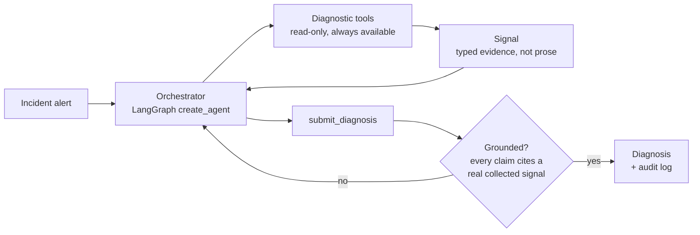

# Data Platform Operations Agent

This is an agent that diagnoses failures across Kafka, Flink, and dbt. It follows lineage across system boundaries instead of just reacting to whichever alert fired, and proposes remediation for a human to approve. It never auto-executes. Diagnosis and proposal are the agent's job, approval and execution stay a human decision.

This README covers what's actually built and how it works.

## Status

**Phase 1 of 5, implemented and verified end-to-end against a live model.** Kafka-only diagnostics for now, no lineage yet, no proposal or execution capability. See [Roadmap](#roadmap).

| Module | Status | Docs |
| --- | --- | --- |
| Kafka | ✅ Implemented | [`docs/kafka.md`](docs/kafka.md) |
| Flink | 📋 Planned (Phase 2) | [`docs/flink.md`](docs/flink.md) |
| dbt | 📋 Planned (Phase 3) | [`docs/dbt.md`](docs/dbt.md) |

## Why this exists

Most incidents in a Kafka/Flink/dbt stack cascade instead of originating where the alert fires. A Kafka broker under-replicates a partition, Flink's source operator idles on it, the job's watermark stalls, and three hops downstream a dbt freshness test fails. An on-call engineer, or a naive agent, sees only the dbt failure and starts debugging dbt. This agent walks that chain backward to find the actual origin before proposing anything.

## Architecture



The orchestrator is a single tool-calling loop (`langchain.agents.create_agent`, built on LangGraph), not a multi-agent graph. A flat loop is the right fit for "call diagnostic tools until you have grounded evidence, then conclude." See [`docs/kafka.md`](docs/kafka.md) for the exact call sequence.

**The one property every module is built around:** the model can't just assert a diagnosis. `submit_diagnosis` is validated by a pydantic `model_validator` that rejects any `evidence_chain` citing a signal the model didn't actually receive from a real tool call this session. That's enforced in code, not just by prompting. Details in [`docs/kafka.md#grounding-how-the-evidence-chain-is-enforced`](docs/kafka.md#grounding-how-the-evidence-chain-is-enforced).

## Set up

Python 3.11+ is required. Running the build script creates a virtualenv (`.venv`) and installs the project with its dev dependencies:

```
$ ./auto/build
```

An `ANTHROPIC_API_KEY` is needed to actually run the agent (not the offline test suite):

```
$ export ANTHROPIC_API_KEY=sk-ant-...
```

LangSmith tracing is optional and off by default. It's separate from the audit log described above: the audit log is the compliance record (every diagnosis, every signal, kept for review), LangSmith is a developer-facing view into a run (tool calls, latency, token usage) for debugging. Set these to turn it on, or leave them unset and nothing changes:

```
$ export LANGSMITH_TRACING=true
$ export LANGSMITH_API_KEY=ls__...
```

## How to run this application

#### To run all the tests:

```
$ ./auto/test
```

24/24 offline tests pass without any live dependency (Kafka, Schema Registry, or Anthropic). Args pass through, so `./auto/test -m llm` also runs the full loop against a live model.

Worth being precise about what this suite checks: it's correctness testing, not agent evaluation. It verifies each tool computes the right severity for known fixture data, and that the grounding validator rejects an ungrounded or empty evidence chain. Even the live-model test only checks structural properties (a tool was called, the evidence chain is grounded), not whether the diagnosis is actually correct.

A separate, minimum-viable eval suite covers that: `./auto/eval` runs the agent against four labeled incident scenarios against a live model, and grades each one deterministically, checking whether the correct root-cause signal type was actually cited in the evidence chain, not by judging the hypothesis text. It's real evaluation, not just correctness testing, but still a starting point: four scenarios, single-shot grading (no repeat-and-average to smooth over model non-determinism), and no LLM-as-judge yet.

#### Diagnose an incident:

```
$ ./auto/run diagnose \
    --fixture tests/fixtures/kafka/urp_lag_spike_incident.json \
    --alert-text "PagerDuty: consumer lag alert on billing-svc/orders"
```

This runs entirely offline except for the model call. No live Kafka cluster is needed, since `--fixture` points at a canned incident snapshot (see [`docs/kafka.md`](docs/kafka.md#the-gateway-abstraction-one-seam-two-implementations) for how that works). Output is a JSON `Diagnosis` with a full evidence chain, plus a path to the append-only audit log for the session.

#### Help options:

To see all available options, run `./auto/run diagnose --help`.

## Project structure

```
src/dp_ops_agent/
├── cli.py                    # `dp-ops-agent diagnose ...`
├── orchestrator/              # the LangGraph agent session + system prompt
├── tools/
│   ├── registry.py            # assembles the tool list per phase
│   ├── kafka/                 # implemented: gateway, live/fixture impls, tool definitions
│   └── diagnosis_output/      # the submit_diagnosis tool (grounded structured output)
├── evidence/schema.py         # Signal, Diagnosis, Proposal, ApprovalRecord (typed contracts)
├── audit/                     # append-only JSONL audit log
└── runbook/                   # stub, becomes a RAG index in Phase 3
```

## Roadmap

1. **Single-system prototype**: Kafka diagnostics, no lineage. *(done, see [`docs/kafka.md`](docs/kafka.md))*
2. **Lineage + Flink**: cross-system localization. *(planned, see [`docs/flink.md`](docs/flink.md))*
3. **dbt + data quality, and proposals**: full four-module coverage. *(planned, see [`docs/dbt.md`](docs/dbt.md))*
4. **Execution tool + tiered approval UX**: gated behind a human-approval record, checked independently at the middleware layer and inside the tool itself.
5. **Trust-based autonomy expansion**: deferred pending audit history showing consistently correct Tier 1 proposals.
