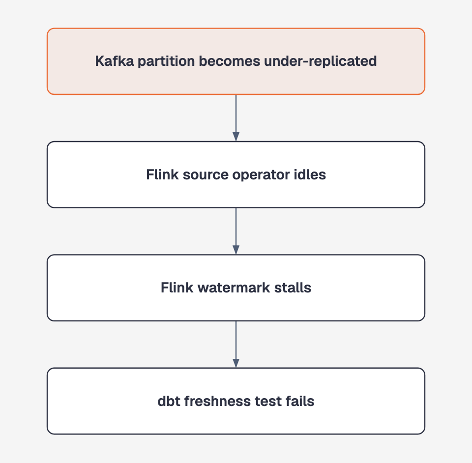
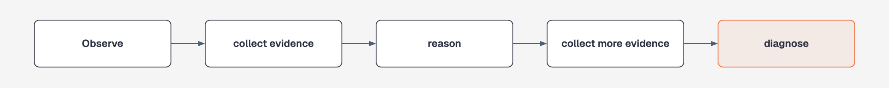
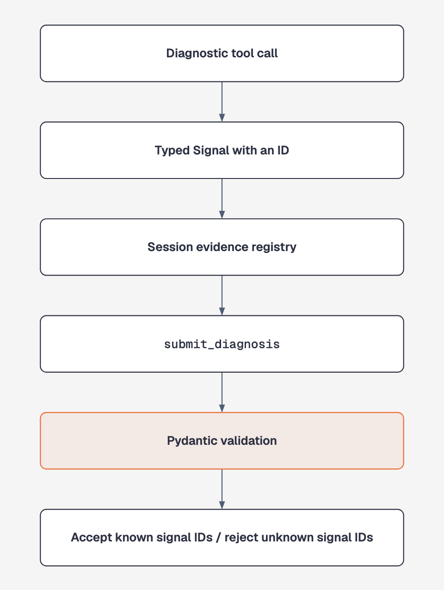

# Data Platform Operations Agent

[](https://github.com/mbelekar/dp-operations-agent/actions/workflows/tests.yml)

A data platform operations agent that investigates failures across Kafka, Flink, and dbt, then produces a diagnosis grounded in evidence collected through tools, optionally with a remediation proposal for a human to review.

It is designed to find **where an incident started**, not just where the alert appeared.

> **Current scope:** diagnosis and Tier 0/1 remediation proposals. The agent never executes changes.


The demo is a real `./auto/run diagnose` invocation against fixture data and a live model. The model wait has been sped up; the output is not staged.

## What it does

- Diagnoses incidents across Kafka, Flink, lineage, and dbt
- Traces downstream symptoms back to upstream causes
- Collects operational evidence through typed diagnostic tools
- Rejects conclusions that cite evidence the agent did not observe
- Proposes one reversible, narrow remediation (or none) with a code-generated command, rollback, and warnings
- Records signals, diagnoses, proposals, and usage in an append-only audit log
- Supports deterministic fixture-based testing and optional live infrastructure

## Why this exists

Data-platform failures often surface far from their origin:

<p align="center">
  
</p>

The alert says **dbt freshness failure**, but the root cause is in Kafka.

A conventional alert shows where the problem surfaced. This agent follows lineage and operational evidence backwards to determine where it began.

## Current capabilities

The project is at **Phase 3b of 5**.

| Capability | Status | Details |
| --- | --- | --- |
| Kafka diagnostics | ✅ Implemented | [Kafka documentation](docs/kafka.md) |
| Flink diagnostics | ✅ Implemented | [Flink documentation](docs/flink.md) |
| Cross-system lineage | ✅ Implemented | [Lineage documentation](docs/lineage.md) |
| dbt diagnostics | ✅ Implemented | [dbt documentation](docs/dbt.md) |
| Grounded evidence chains | ✅ Implemented | Enforced in code |
| Append-only audit trail | ✅ Implemented | Signals, diagnoses, proposals, and usage |
| Remediation proposals | ✅ Implemented (Tier 0/1) | [Proposals documentation](docs/proposals.md) |
| Human-approved execution | 📋 Planned | Phase 4 |

The implemented three-hop scenario traces a dbt freshness failure through Flink to a Kafka root cause.

## How it works


### One agent, deliberately

The orchestrator uses a single tool-calling loop built with `langchain.agents.create_agent` and LangGraph:

<p align="center">
  
</p>

Kafka, Flink, lineage, and dbt tools are available in every session. This allows an investigation to move between systems without handing control between multiple agents.

### Grounding is enforced in code

The model cannot submit an unsupported diagnosis:

<p align="center">
  
</p>

Every item in a diagnosis's `evidence_chain` must reference a signal returned by a real tool call in that session. A Pydantic `model_validator` enforces this independently of the prompt.

See [the grounding design](docs/kafka.md#evidence-grounding) and [architecture decisions](docs/decisions/) for more detail.

## Quick start

### Requirements

- Python 3.11+
- An Anthropic API key for agent runs
- No Kafka, Flink, Marquez, or dbt installation for the fixture-based path

### Build

```bash
./auto/build
```

The build creates `.venv` and installs the project with its development dependencies.

### Configure the model

```bash
export ANTHROPIC_API_KEY=sk-ant-...
```

### Diagnose an incident

```bash
./auto/run diagnose \
  --fixture tests/fixtures/kafka/urp_lag_spike_incident.json \
  --flink-fixture tests/fixtures/flink/healthy_baseline.json \
  --lineage-fixture tests/fixtures/lineage/empty.json \
  --dbt-fixture tests/fixtures/dbt/healthy_baseline.json \
  --alert-text "PagerDuty: consumer lag alert on billing-svc/orders"
```

The command uses canned infrastructure snapshots and makes one live model call. It returns a structured JSON `Diagnosis`, including the evidence chain and any proposal, and the path to the session audit log.

All four fixture arguments are required because every diagnostic session exposes all four tool groups. Run the following for the full CLI reference:

```bash
./auto/run diagnose --help
```

For cross-system examples, see the [lineage](docs/lineage.md#example) and [dbt](docs/dbt.md#example) documentation.

## Testing and evaluation

Tests and evaluations answer different questions.

| Layer | What it verifies | Live model required? |
| --- | --- | --- |
| Tool tests | Tools calculate the expected signals and severity | No |
| Wiring tests | Gateways, tools, registry, and agent components connect correctly | No |
| Grounding tests | Empty or unsupported evidence chains are rejected | No |
| Live-model test | The agent calls tools and returns a grounded structure | Yes |
| Agent evaluations | The diagnosis cites the expected root-cause signal type | Yes |

### Offline test suite

```bash
./auto/test
```

**196/196 tests** run without Kafka, Flink, Marquez, dbt, or Anthropic.

To include the live-model test:

```bash
./auto/test -m llm
```

The test suite verifies code and structural correctness. It does not claim that every diagnosis is correct.

### Agent evaluation suite

```bash
./auto/eval
```

The evaluation suite runs nine labeled incidents:

- Four Kafka scenarios
- One Flink scenario
- Two dbt scenarios
- One Flink-to-Kafka scenario
- One dbt-to-Flink-to-Kafka scenario

Each run is graded deterministically by checking whether the diagnosis cites the expected root-cause signal type. There is no LLM-as-judge.

Run only the scenarios affected by a change when possible, because each scenario is a billed model session:

```bash
./auto/eval \
  --scenario cross_system_dbt_freshness_to_isr_churn \
  --repeat 2
```

`--scenario` may be supplied more than once. `--repeat` supports up to two runs per scenario. Repeated runs help expose inconsistent behaviour, but two successful runs are not proof of reliability.

Each run reports its token usage, also recorded per session as a `session_usage` audit event. Prompt caching is enabled, so most input tokens are billed at the cached rate.

## Optional observability

LangSmith tracing is off by default:

```bash
export LANGSMITH_TRACING=true
export LANGSMITH_API_KEY=ls__...
```

The two records serve different purposes:

| Record | Purpose |
| --- | --- |
| Audit log | Reviewable record of collected signals, diagnoses, and session usage |
| LangSmith trace | Developer view of tool calls, latency, and token usage |

## Optional live infrastructure

The fixture path is the fastest way to run the project. An opt-in Docker environment is also available to exercise the `Live*Gateway` implementations against:

- A three-broker Kafka cluster
- A real Flink job
- Marquez seeded with the job's lineage

```bash
./auto/live-up
docker compose --profile app run --rm --no-deps -T app
./auto/live-down
```

See [Docker documentation](docs/docker.md) for memory requirements, components, and known gaps. The live stack does not yet contain a dbt project.

## Project structure

```text
auto/                          # build, test, run, eval, and live-infra scripts
docker/                        # Kafka, Flink, metrics, and Marquez support
docker-compose.yml             # optional live infrastructure
Dockerfile                     # containerized application
evals/                         # scenarios, deterministic grading, and runner
tests/                         # unit, integration, and fixture-based tests
src/dp_ops_agent/
├── cli.py                     # diagnose command
├── orchestrator/              # agent session and system prompt
├── tools/
│   ├── registry.py            # tool assembly
│   ├── kafka/                 # Kafka gateways and diagnostic tools
│   ├── flink/                 # Flink gateways and diagnostic tools
│   ├── lineage/               # Marquez-backed lineage tools
│   ├── dbt/                   # dbt artifact and state inspection
│   └── diagnosis_output/      # grounded diagnosis submission
├── evidence/schema.py         # typed domain contracts
├── audit/                     # append-only JSONL audit log
└── runbook/                   # placeholder for Phase 3c RAG index
```

## Roadmap

| Phase | Outcome | Status |
| --- | --- | --- |
| 1 | Kafka single-system diagnostics | ✅ Done |
| 2a | Flink diagnostics | ✅ Done |
| 2b | Cross-system lineage | ✅ Done |
| 3a | dbt diagnostics and upstream root-cause tracing | ✅ Done |
| 3b | Tier 0/1 remediation proposals, reviewed by a human | ✅ Done |
| 3c | Data-quality module and runbook RAG | 📋 Planned |
| 4 | Execution tools gated by independently checked human approval | 📋 Planned |
| 5 | Evidence-based expansion of trusted autonomy | 📋 Deferred |

Automatic execution remains intentionally out of scope until the system has an approval boundary and an audit history demonstrating reliable low-risk proposals.

## Documentation

- [Kafka diagnostics](docs/kafka.md)
- [Flink diagnostics](docs/flink.md)
- [Cross-system lineage](docs/lineage.md)
- [dbt diagnostics](docs/dbt.md)
- [Remediation proposals](docs/proposals.md)
- [Docker environment](docs/docker.md)
- [Architecture decisions](docs/decisions/)
