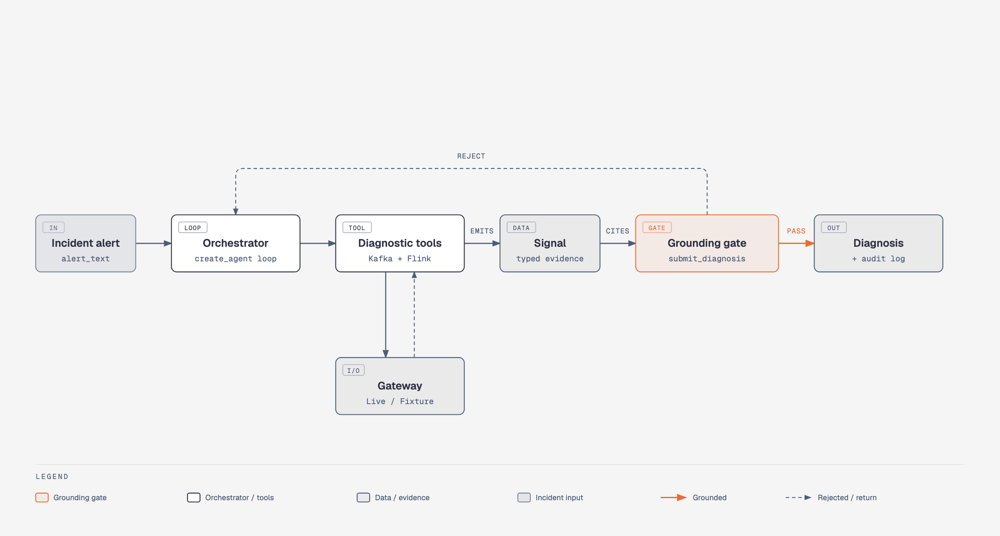

# Data Platform Operations Agent


This agent diagnoses failures across Kafka, Flink, and dbt. It traces a root cause across system boundaries instead of stopping at whichever alert fired, and proposes a fix for a human to approve. It does not execute anything automatically. Diagnosis and proposal are the agent's job. Approval and execution are a human's job.

This README describes what is actually built and how it works.


The recording above is a real run: `./auto/run diagnose` against the fixture incident, against a live model, no staged output. The wait between the command and the result is the actual model call, sped up in the GIF.

## Status

Phase 3a of 5. Kafka, Flink, lineage tracing, and dbt are all implemented. An alert on one system can be traced to a root cause on another, including Design.md's three-hop case: a dbt freshness failure traced through a Flink job to a Kafka root cause. There is no proposal or execution capability yet. See [Roadmap](#roadmap).

| Module | Status | Docs |
| --- | --- | --- |
| Kafka | ✅ Implemented | [`docs/kafka.md`](docs/kafka.md) |
| Flink | ✅ Implemented | [`docs/flink.md`](docs/flink.md) |
| Lineage | ✅ Implemented | [`docs/lineage.md`](docs/lineage.md) |
| dbt | ✅ Implemented (Phase 3a) | [`docs/dbt.md`](docs/dbt.md) |

## Why this exists

Most incidents in a Kafka/Flink/dbt stack cascade instead of starting where the alert fires. A Kafka broker under-replicates a partition. Flink's source operator idles on it. The job's watermark stalls. Three hops downstream, a dbt freshness test fails. An on-call engineer, or a naive agent, sees only the dbt failure and starts debugging dbt. This agent walks that chain backward to find the real origin before proposing anything.

## Architecture



The orchestrator is a single tool-calling loop (`langchain.agents.create_agent`, built on LangGraph), not a multi-agent graph. It calls diagnostic tools until it has grounded evidence, then concludes. Kafka, Flink, dbt, and lineage tools are all available in every session, so an alert on one system can be traced to a root cause on another, see [`docs/lineage.md`](docs/lineage.md) for the cross-system scenario this proves. See [`docs/kafka.md`](docs/kafka.md) for the exact call sequence.

Every module is built around one property: the model cannot just assert a diagnosis. `submit_diagnosis` is validated by a pydantic `model_validator` that rejects any `evidence_chain` citing a signal the model did not actually receive from a real tool call in that session. This is enforced in code, not by prompting alone. Details in [`docs/kafka.md#grounding-how-the-evidence-chain-is-enforced`](docs/kafka.md#grounding-how-the-evidence-chain-is-enforced).

See [`docs/decisions/`](docs/decisions/) for the reasoning behind these choices, including what was considered and rejected.

## Set up

Python 3.11+ is required. The build script creates a virtualenv (`.venv`) and installs the project with its dev dependencies:

```
$ ./auto/build
```

An `ANTHROPIC_API_KEY` is needed to run the agent (not the offline test suite):

```
$ export ANTHROPIC_API_KEY=sk-ant-...
```

LangSmith tracing is optional and off by default. It is separate from the audit log: the audit log is the compliance record (every diagnosis, every signal, kept for review). LangSmith is a developer view into a run (tool calls, latency, token usage) for debugging. Set these to turn it on:

```
$ export LANGSMITH_TRACING=true
$ export LANGSMITH_API_KEY=ls__...
```

## How to run this application

#### To run all the tests:

```
$ ./auto/test
```

144/144 offline tests pass with no live dependency (Kafka, Flink, Marquez, dbt, or Anthropic). Args pass through, so `./auto/test -m llm` also runs the full loop against a live model.

This suite checks code correctness, not agent evaluation. It checks that each tool computes the right severity for known fixture data, and that the grounding validator rejects an ungrounded or empty evidence chain. Even the live-model test only checks structural properties (a tool was called, the evidence chain is grounded), not whether the diagnosis is actually correct.

A separate eval suite checks that. `./auto/eval` runs the agent against eight labeled incident scenarios (four Kafka, one Flink, one dbt, and two cross-system: Flink to Kafka, and dbt through Flink to Kafka) on a live model, and grades each one, checking whether the correct root-cause signal type was cited in the evidence chain. This is a starting point: eight scenarios, single-shot grading, no LLM-as-judge yet.

#### Diagnose an incident:

```
$ ./auto/run diagnose \
    --fixture tests/fixtures/kafka/urp_lag_spike_incident.json \
    --flink-fixture tests/fixtures/flink/healthy_baseline.json \
    --lineage-fixture tests/fixtures/lineage/empty.json \
    --dbt-fixture tests/fixtures/dbt/healthy_baseline.json \
    --alert-text "PagerDuty: consumer lag alert on billing-svc/orders"
```

This runs entirely offline except for the model call. No live Kafka, Flink, Marquez, or dbt project is needed: `--fixture`/`--flink-fixture`/`--lineage-fixture`/`--dbt-fixture` point at canned incident snapshots (see [`docs/kafka.md`](docs/kafka.md#the-gateway-abstraction-one-seam-two-implementations) for how that works). All four fixtures are required even for a single-system incident, since Kafka, Flink, lineage, and dbt tools are always available in a session (see [`docs/flink.md`](docs/flink.md#why-kafka-flink-and-lineage-tools-are-all-always-available)). Output is a JSON `Diagnosis` with a full evidence chain, plus a path to the audit log for the session.

For the cross-system scenarios, where an alert on one system traces to a root cause on another, see [`docs/lineage.md`](docs/lineage.md#example-run) and [`docs/dbt.md`](docs/dbt.md#example-run).

#### Help options:

Run `./auto/run diagnose --help` to see all available options.

#### Run against live infra (optional):

The fixture path above is the default for a reason: instant, deterministic, no Docker needed. There's a separate, opt-in path that stands up a real 3-broker Kafka cluster, a real Flink job, and Marquez seeded with that job's lineage, with Docker, so the `Live*Gateway` implementations can be proven against actual infra instead of canned JSON:

```
$ ./auto/live-up
$ docker compose --profile app run --rm --no-deps -T app
$ ./auto/live-down
```

See [`docs/docker.md`](docs/docker.md) for what gets stood up, memory requirements, and known gaps (including that there's no dbt project in the stack yet).

## Project structure

```
auto/                          # ./auto/{build,test,run,eval,live-up,live-down} entrypoint scripts
docker/                        # live-infra pieces: jmx-exporter, metrics-aggregator, flink-job, kafka-seed, marquez-seed
docker-compose.yml             # optional: real Kafka + Flink + Marquez, see docs/docker.md
Dockerfile                     # the app itself, containerized
evals/                         # minimum-viable eval suite (scenarios.py, grading.py, runner.py)
tests/                         # unit + integration tests, plus fixture snapshots
src/dp_ops_agent/
├── cli.py                    # `dp-ops-agent diagnose ...`
├── orchestrator/              # the LangGraph agent session + system prompt
├── tools/
│   ├── registry.py            # assembles the tool list every session gets
│   ├── kafka/                 # implemented: gateway, live/fixture impls, tool definitions
│   ├── flink/                 # implemented: same pattern as kafka/
│   ├── lineage/               # implemented: same pattern, Marquez-backed
│   ├── dbt/                   # implemented: same pattern, reads a dbt target/ + --state dir
│   └── diagnosis_output/      # the submit_diagnosis tool (grounded structured output)
├── evidence/schema.py         # Signal, Diagnosis, Proposal, ApprovalRecord (typed contracts)
├── audit/                     # append-only JSONL audit log
└── runbook/                   # stub, becomes a RAG index in Phase 3c
```

## Roadmap

1. **Single-system prototype**: Kafka diagnostics, no lineage. *(done, see [`docs/kafka.md`](docs/kafka.md))*
2. **Lineage + Flink**: cross-system localization.
   - 2a. Flink module. *(done, see [`docs/flink.md`](docs/flink.md))*
   - 2b. Lineage tool. Proves cross-system localization. *(done, see [`docs/lineage.md`](docs/lineage.md))*
3. **dbt + data quality, and proposals**: full four-module coverage.
   - 3a. dbt module. Proves a dbt symptom can be traced to an upstream root cause. *(done, see [`docs/dbt.md`](docs/dbt.md))*
   - 3b. Proposals: a tiered remediation `Proposal` on each diagnosis, informational only. *(planned)*
   - 3c. Data-quality module and runbook RAG. *(planned)*
4. **Execution tool + tiered approval UX**: gated behind a human-approval record, checked independently at the middleware layer and inside the tool itself.
5. **Trust-based autonomy expansion**: deferred pending audit history showing consistently correct Tier 1 proposals.
