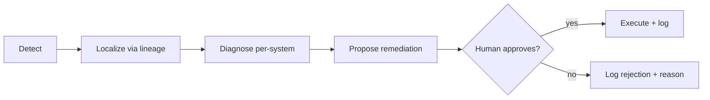
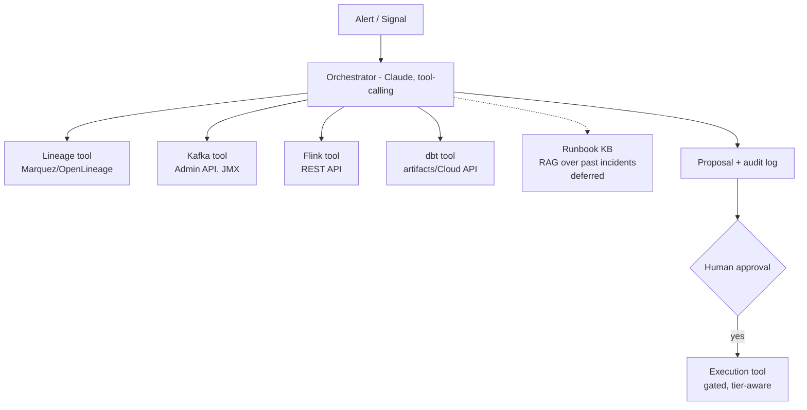

# Data Platform Operations Agent: Design

2026-09-20 · @mbelekar

## Overview & scope

The agent diagnoses failures across Kafka, Flink, and dbt, and proposes remediation for human approval. It does not auto-execute changes in v1.

**In scope**

- Root-cause diagnosis that follows lineage across system boundaries, not just single-system symptoms
- Evidence-backed remediation proposals (what to do, why, and what it will affect)
- A human approval gate before any state-changing action runs
- An audit trail of every diagnosis and every approved/rejected action

**Out of scope for v1**

- Autonomous execution of remediations (deferred to a later phase once trust is established)
- Infrastructure provisioning or capacity planning
- Cost optimization

**Autonomy level:** diagnose + propose. The agent always stops at a proposal; a human clicks approve/reject before anything touches production state (a replay, a restart, a backfill).

## Core diagnostic loop

Most incidents in this stack cascade rather than originate where the alert fires. The loop is built around finding the true origin before proposing a fix.

**Cascading example:** a Kafka broker under-replicates a partition → Flink's source operator idles on that partition → the job's watermark stalls → a dbt incremental model built on that stream sees a partial window → a freshness test fails three hops downstream. Without lineage-aware localization, an agent (or an on-call engineer) sees only the dbt test failure and starts debugging dbt. The localization step walks the lineage graph backward from the failing test to find the Kafka partition as the actual root cause.

## Kafka diagnostic module

| Signal | Source | What it can mean |
| --- | --- | --- |
| Consumer lag trend | Kafka Admin API / Burrow | Growing = processing can't keep up; flat-high = stuck consumer; sudden spike = upstream burst |
| Under-replicated / offline partitions | Broker JMX metrics | Broker failure, disk pressure, or network partition |
| ISR shrink/expand churn | Broker JMX metrics | Flaky broker, GC pauses, or network instability |
| Rebalance frequency | Consumer group API | Session-timeout misconfig, slow poll loop, or consumer crash-looping |
| Hot partition / key skew | Per-partition throughput | Poor partition key choice or a single noisy producer |
| Schema registry compatibility failure | Schema Registry API | A producer shipped an incompatible schema change |

Evidence gathering pulls the last N minutes of these metrics plus recent broker/controller logs around the incident window, and correlates the timing against known deploys (producer or consumer service releases) before forming a hypothesis.

## Flink diagnostic module

| Signal | Source | What it can mean |
| --- | --- | --- |
| Checkpoint failure/timeout | Flink REST API `/jobs/:id/checkpoints` | Growing state size, slow sink, or backpressure upstream of the barrier |
| Backpressure ratio per operator | Flink REST API `/jobs/:id/vertices/:id/backpressure` | Localizes the actual bottleneck operator, not just "the job is slow" |
| Watermark lag / idle source | Flink metrics (`currentInputWatermark`) | Event-time skew, often caused by a stalled upstream Kafka partition |
| State backend disk pressure | RocksDB metrics / TaskManager disk metrics | State growth from a skewed key, missing TTL, or unbounded window |
| Savepoint restore failure | Job manager logs | Incompatible state schema after a job graph or operator UID change |

Backpressure localization matters most here: the agent walks the operator chain from sink to source using the REST API's per-vertex backpressure ratio to find which operator is actually saturated, rather than restarting the whole job, a common but often ineffective first response.

## dbt diagnostic module

| Signal | Source | What it can mean |
| --- | --- | --- |
| Test failure (not-null, unique, relationships, custom) | dbt run artifacts (`run_results.json`) | Data-quality issue in the model or its inputs, usually upstream, not the model's SQL |
| Model run failure (compile or execution error) | dbt run artifacts / warehouse logs | Schema change, broken ref, or warehouse resource limit |
| Freshness check failure | `sources.json` from `dbt source freshness` | Almost always upstream: the loader or streaming sink stopped landing data on schedule |
| Incremental model drift | Row-count / max-timestamp comparison vs. expected | A gap in the upstream stream (e.g., a replay window that didn't fully backfill) |
| Dependency-graph compile error after schema change | `manifest.json` diff | An upstream table changed shape without a corresponding model update |

The agent distinguishes "the model's logic is wrong" from "the model is correct but its inputs are bad" by checking whether the same test passed on the previous run with no code change. If so, the fault is almost certainly upstream, and the agent routes the investigation there via lineage rather than suggesting a model edit.

## Lineage integration

Lineage is what turns four separate diagnostic modules into one platform-aware agent. Without it, the agent (or an engineer) only sees the symptom's location, not its cause.

- **Backbone:** OpenLineage events emitted by dbt (native support) and Flink (via the OpenLineage Flink integration), collected in Marquez, plus Kafka topic-to-consumer-group mappings pulled from the schema registry and consumer group metadata.
- **Column-level lineage** matters, not just table-level: a schema failure on one field should scope the blast radius to that field's actual downstream consumers, not fan out an incident to every consumer of the table.
- **Query pattern:** given a failing node (a dbt test, a Flink job, a Kafka topic), walk upstream through the lineage graph, filter to nodes that changed or degraded within the incident window, and rank candidates by proximity and by whether their own health signals were anomalous at that time.

This graph is also what scopes remediation blast radius (Remediation workflow, below): before proposing a replay or restart, the agent lists every downstream consumer that action would affect.

## Replay & state management

This is the highest-risk category because replaying data into a stateful, exactly-once pipeline can silently double-count or corrupt state if idempotency isn't understood first.

**Idempotency model:** before ever proposing a replay, the agent looks up a per-sink idempotency rating maintained in a small registry: `idempotent` (safe, e.g., an upsert-by-key sink), `dedupable` (safe if replayed with the original event keys/timestamps, e.g., a sink with dedup logic), or `append-only` (unsafe: replay will duplicate rows; requires a compensating delete/backfill step).

**Replay mechanisms it reasons about:**

- Kafka offset replay for a single consumer group, scoped to a narrow offset/time range
- Flink savepoint or checkpoint restore, including compatibility checks when operator UIDs or the job graph changed since the savepoint was taken
- dbt full-refresh or targeted backfill of an incremental model for a specific date range

**Safety checks before proposing any replay:**

1. Sink idempotency rating (above)
2. Downstream consumer list from the lineage graph: who else reads this data and would be affected
3. Estimated data volume and time-to-replay, so the proposal states cost, not just action
4. Whether a partial replay already happened (avoiding re-replaying an already-recovered range)

## Remediation workflow & approval tiers

Every proposal is tiered by blast radius and reversibility, which controls how it's presented, not whether it's diagnosed. Given the chosen autonomy level (diagnose + propose, nothing auto-executes), all tiers currently route to a human approval step; the tiering still matters because it changes what evidence and warnings accompany the proposal.

| Tier | Example actions | What the proposal must include |
| --- | --- | --- |
| 0: informational | No action; root cause identified | Evidence chain, confidence level |
| 1: reversible, narrow | Restart a Flink job from last good checkpoint; re-run one dbt model; replay a narrow Kafka offset range for one consumer group | Above + expected outcome, rollback step |
| 2: state-changing, broad | Full topic replay; savepoint migration across a job-graph change; multi-day dbt backfill | Above + downstream consumer list, estimated volume/duration, idempotency rating, explicit "this cannot be easily undone" flag |

**Approval UX:** each proposal shows the evidence chain (what was observed, in what order, across which systems), the exact action to be taken (e.g., the literal `kafka-consumer-groups` offset command or Flink REST call), and its blast radius, before the approve/reject control. Every decision (approved, rejected, or expired without action) is logged with the reviewer, timestamp, and reasoning if given, forming the audit trail and the training signal for later tightening or loosening autonomy.

## Agent architecture

- **Orchestrator:** a tool-calling LLM (Claude) that runs the detect → localize → diagnose → propose loop. All diagnostic tools are read-only and always available; the execution tool is separate, tier-aware, and only callable after an approval record exists.
- **Diagnostic tools:** thin, typed clients over the Kafka Admin API, Flink REST API, dbt artifacts/Cloud API, and the lineage query API. Each returns structured evidence, not free text, so the orchestrator's reasoning stays grounded in real metrics rather than paraphrased summaries.
- **Runbook knowledge base (deferred):** a RAG index over past incident write-ups and known remediation patterns, so recurring failure signatures get faster, more consistent proposals over time. Not scheduled; it needs a corpus of incident write-ups first.
- **Permission boundary:** enforced outside the LLM, in the tool layer. The execution tool itself checks for a valid, unexpired approval record matching the exact proposed action before it will run anything, so a prompt-level mistake can't skip the gate.

## Evaluation

Tests verify code correctness (does a diagnostic tool compute severity correctly for known input) and grounding enforcement (does the evidence-chain validator actually reject an ungrounded claim). Neither checks whether the agent's diagnosis is *right*. A separate evaluation suite closes that gap: a small set of labeled incident scenarios, each with a known root-cause signal, run against a live model and graded automatically.

**Grading is deterministic for now, not LLM-as-judge.** Each scenario declares the signal type that represents its true root cause. A run passes if that signal type appears among the signals actually *cited* in the final evidence chain, not merely collected during the session, but used to support the stated hypothesis. This reuses the same typed evidence contracts the grounding validator already enforces, rather than matching free text in the hypothesis itself, which would be fragile to wording changes. LLM-as-judge grading is a reasonable next step once the deterministic loop is proven out, particularly for scenarios where "correct" isn't reducible to a single signal type.

**Scenarios are incident fixtures, not synthetic cases invented just for evaluation.** The same fixture files used to unit-test individual diagnostic tools double as evaluation scenarios, each paired with its expected root-cause signal type: one incident definition, used for both code-level and agent-level testing, rather than two parallel sets of incident data drifting apart over time.

The suite is expected to grow alongside each phase: new modules (Flink, dbt) bring their own incident fixtures, and each one becomes both a unit-test fixture and an evaluation scenario, the same way the four Kafka scenarios do today.

## Build roadmap

| Phase | Scope | Autonomy |
| --- | --- | --- |
| 1. Single-system prototype | Kafka OR Flink diagnostics only, no lineage yet; proves the tool-calling loop and evidence format | Diagnose only |
| 2. Add lineage + second system | Wire in OpenLineage/Marquez; add the second of Kafka/Flink; localization across two systems | Diagnose only |
| 3. dbt coverage + proposals | Add the dbt module and Tier 0/1 remediation proposals; cascading-failure localization across Kafka, Flink, and dbt | Diagnose + propose (no execution tool yet) |
| 4. Approval records | Record human approve/reject decisions on Tier 0/1 proposals; executing approved proposals is deferred (ADR-0011) | Diagnose + propose, human approves and runs |
| 5. Trust-based autonomy expansion | Once audit history shows consistent, correct Tier 1 proposals, consider auto-executing Tier 1 only, always with Tier 2 gated | Selective auto-remediation (future) |

Phase 1 is the right starting point for a working prototype: pick one system (Kafka or Flink, whichever has more current incident volume) and build the orchestrator + one diagnostic tool + a proposal output, before adding lineage or the other systems.

Each phase that adds a diagnostic module should extend the evaluation suite (see Evaluation, above) with at least one scenario for its new signals, not just unit tests for the tools themselves.
