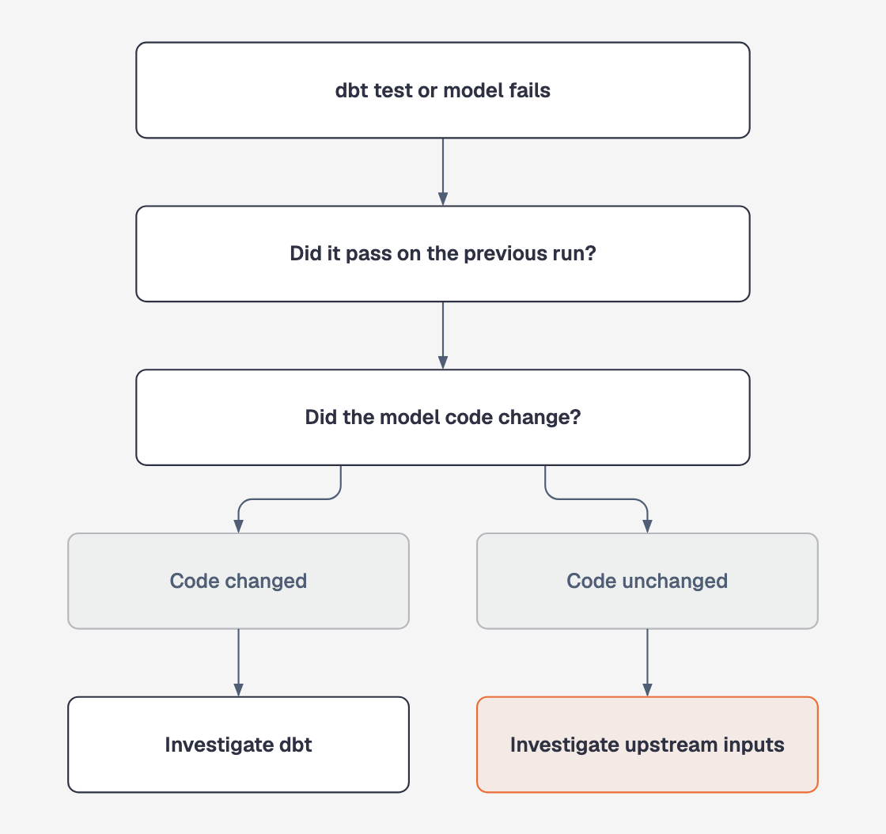

# dbt diagnostic module

> **Status:** Implemented in Phase 3a · Proposals from Phase 3b · Nothing is executed

The dbt module distinguishes failures caused by model changes from failures caused by bad or missing upstream data.

It uses current and previous dbt artifacts, then follows [lineage](lineage.md) when the evidence points upstream. A dbt root cause can carry a `rerun_dbt_model` [proposal](proposals.md) for human review; execution is not implemented.

## Core decision

<p align="center">
  
</p>

The actual rule is:

| Previous result | Model code | Investigation direction |
| --- | --- | --- |
| Passed | Unchanged | Upstream input is the stronger suspect |
| Passed | Changed | Model regression is the stronger suspect |
| No previous run | Unknown | Investigate both directions |

"Code changed" is calculated from the current and previous `manifest.json` checksums, using the same basis as dbt's `state:modified` selector. The model does not infer it.

## What it can diagnose

| Tool | Reads | Detects |
| --- | --- | --- |
| `test_failure` | Current and previous `run_results.json` and `manifest.json` | Failing tests, whether they previously passed, and whether model code changed |
| `model_run_failure` | `run_results.json`, `manifest.json` | Errored models and models skipped after a parent failure |
| `freshness_check_failure` | `sources.json` | Stale sources caused by missing upstream delivery |
| `incremental_model_drift` | Current and previous adapter responses | Large drops in incremental `rows_affected` |
| `dependency_graph_compile_error` | Current and previous `catalog.json`, plus `manifest.json` | Parent columns added, removed, or retyped before a model error |

Each signal includes:

- `scope.lineage_node_id`, ready for `walk_lineage_upstream`; and
- `artifacts_generated_at`, so callers can assess whether artifacts may be stale.

The shared evidence-grounding mechanism is described in [Kafka evidence grounding](kafka.md#evidence-grounding).

## Gateway design

dbt tools depend on the `DbtArtifactsGateway` protocol. Every method selects either the current run or the previous `state` run.

| Implementation | Purpose | Data source |
| --- | --- | --- |
| `LiveDbtGateway` | Local dbt-core projects | Current `target/` and previous state directory |
| `FixtureDbtGateway` | Deterministic tests and evaluations | JSON snapshots in gateway view format |

The live gateway has been verified against dbt-core 1.12.5 with dbt-duckdb and dbt-postgres artifacts:

- `run-results/v6`
- `sources/v3`
- `manifest/v12`
- `catalog/v1`

There is no dbt Cloud client.

## Artifact handling

### Missing artifacts

| Situation | Behaviour |
| --- | --- |
| Current `run_results.json`, `manifest.json`, or `sources.json` is missing | Tool receives `DbtArtifactsUnavailable`; the session continues without that signal |
| Previous-run artifact is missing | Comparison fields such as `previously_passed` and `model_code_changed` become `null` |
| `catalog.json` is missing | Dependency comparison returns `severity: unknown` |
| Model, source, test, or row count is absent | Signal returns `severity: unknown` with `no_data_reason` |

Unknown model and source responses include known identifiers from the manifest when available.

Missing data never becomes `ok`. See [ADR-0009](decisions/0009-no-data-is-unknown-not-ok.md).

### Producing usable artifacts

dbt overwrites `run_results.json` after many commands, including `dbt docs generate`. Use this order:

```bash
dbt source freshness && dbt docs generate && dbt build
cp -R target/ <state-dir>
```

Copy `target/` before the next run so it remains available as the previous state.

`LiveDbtGateway` accepts `run_results.json` produced by `build`, `run`, or `test`. If another command overwrote it, the gateway reports which invocation produced the unusable artifact.

### Stale artifacts

A Jinja compilation failure can abort without writing new artifacts, leaving old files in place. Every signal therefore includes artifact timestamps so stale evidence remains visible.

## Signal limitations

### Incremental drift is heuristic

`incremental_model_drift` uses adapter-reported `rows_affected`, not a warehouse query.

- Some adapters, including dbt-duckdb, may not report it. The result is then `unknown`.
- Full builds and incremental runs are not comparable when their adapter operation codes differ.
- A ratio below 50% of the previous run is `warn`.
- A ratio below 10% is `critical`.

### Schema comparison needs `catalog.json`

`dependency_graph_compile_error` uses catalog columns because manifest columns only include fields documented in YAML. Without a catalog, the result is `unknown` rather than a guess.

See [ADR-0008](decisions/0008-dbt-previous-run-via-state-dir.md).

## Node IDs

| Node | Format | Example |
| --- | --- | --- |
| dbt model | `job:dbt:{model_name}` | `job:dbt:fct_orders` |
| Warehouse table | `dataset:warehouse:{schema}.{table}` | `dataset:warehouse:raw.orders_sink` |

Real dbt OpenLineage events use warehouse-connection namespaces. Mapping these into the live Marquez graph is not implemented yet.

## Evaluation scenarios

### Upstream three-hop cascade

1. `raw.orders_sink` fails source freshness.
2. A recency test fails and incremental rows collapse from 1,210 to 40.
3. Those tests passed previously and model code is unchanged.
4. Lineage leads to a Flink job with critical watermark lag.
5. Further lineage leads to Kafka, where broker 1 has critical ISR churn.
6. The correct root cause is Kafka `isr_churn`, with `system: kafka`.

### dbt model regression

1. `not_null_fct_orders_amount` fails after passing previously.
2. The `fct_orders` checksum changed.
3. Upstream systems are healthy.
4. The correct root cause is the dbt `test_failure`, with `system: dbt`.

The second scenario prevents the agent from learning a simplistic "always blame upstream" rule.

### Transient model failure

1. `fct_orders` fails because the database aborted it to break a deadlock.
2. It succeeded on the previous run, and its code is unchanged.
3. Its sources are fresh and upstream systems are healthy.
4. The correct root cause is the dbt `model_run_failure`, and the correct [proposal](proposals.md) is `rerun_dbt_model`.

This is the only scenario whose correct answer includes a remediation action. In the regression scenario above, re-running would only reproduce the bug, so no action is correct there.

## Example

```bash
dp-ops-agent diagnose \
  --fixture tests/fixtures/kafka/isr_churn_upstream_incident.json \
  --flink-fixture tests/fixtures/flink/watermark_lag_cross_system_incident.json \
  --lineage-fixture tests/fixtures/lineage/warehouse_table_to_kafka_topic.json \
  --dbt-fixture tests/fixtures/dbt/freshness_failure_upstream_incident.json \
  --alert-text "PagerDuty: dbt source freshness failed for raw.orders_sink"
```

For local dbt artifacts, add `--live` with `--dbt-target-dir` and `--dbt-state-dir`, or set `DBT_TARGET_DIR` and `DBT_STATE_DIR`.

## Testing

| Test area | File | What it verifies |
| --- | --- | --- |
| Tool behaviour | `tests/unit/test_dbt_tools.py` | Decision branches, thresholds, previous-run handling, adapter differences |
| Live artifact parsing | `tests/unit/test_dbt_live_gateway.py` | Realistic dbt artifacts, overwritten results, skipped nodes, missing state |
| Cross-system wiring | `tests/integration/test_registry_wiring.py` | Both scenarios derive the expected root system |
| Agent evaluations | `evals/scenarios.py` | Upstream cascade and dbt regression with a live model |

## Known gaps

- The Docker environment has no dbt project.
- There is no dbt Cloud API client.
- The module does not query the warehouse for row counts.
- dbt nodes are not emitted to live Marquez; dbt lineage is fixture-based.
- The upstream cascade evaluation is not fully reliable. It passed 4 of 6 recorded runs after the ADR-0009 retry-scope fix. In failed runs, the model stopped at Flink watermark lag instead of checking Kafka ISR churn.

The likely improvement is to prevent a downstream symptom from becoming the root cause while upstream health checks remain unexplored. Confirming that change requires repeated billed evaluation runs.
