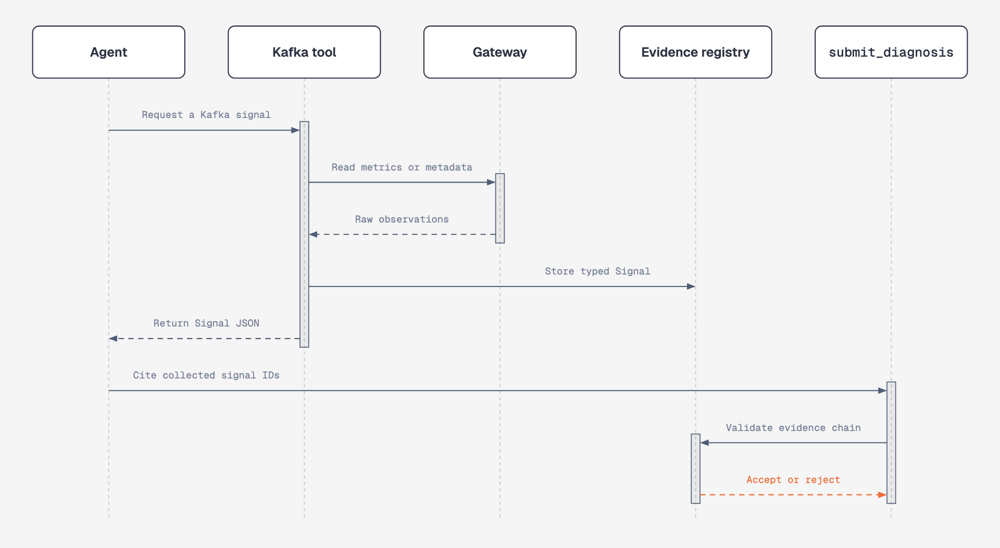

# Kafka diagnostic module

> **Status:** Implemented in Phase 1

The Kafka module investigates broker, partition, consumer, and schema problems using six read-only tools. It returns typed evidence that the agent can cite in a grounded diagnosis.

Related modules: [Flink](flink.md) · [Lineage](lineage.md) · [dbt](dbt.md)

## What it can diagnose

| Tool | Detects | Typical causes |
| --- | --- | --- |
| `under_replicated_partitions` | Replicas missing from the in-sync replica set | Broker failure, disk pressure, network partition |
| `isr_churn` | Frequent ISR shrink and expansion | Flaky broker, GC pauses, network instability |
| `consumer_lag_trend` | Growing lag by partition | Slow or stuck consumer, upstream traffic burst |
| `rebalance_frequency` | Frequent consumer-group transitions | Session timeout, slow poll loop, crash loop |
| `hot_partition_skew` | Uneven throughput across partitions | Poor partition key, noisy producer |
| `schema_registry_compat` | Incompatible schema change | Breaking producer schema |

The first three tools cover the main cascade used by this project:

```text
ISR churn → under-replicated partition → consumer lag
```

The remaining tools help rule out competing explanations.

## How an investigation works

<p align="center">
  
</p>

The full application loop also records `diagnosis_run_started`, `signal_collected`, `tool_error`, `diagnosis_completed`, and `session_usage` events in the audit log.

## Evidence grounding

Grounding is enforced in code at three points:

1. **Structured tool output**  
   Every Kafka tool returns a Pydantic-validated `Signal`, not free text.

2. **Server-side evidence collection**  
   Each tool appends its signal to the session's `collected_signals` registry. The model does not recreate signal payloads.

3. **Diagnosis validation**  
   `Diagnosis.evidence_chain_is_grounded` rejects a diagnosis when:
   - no evidence was collected;
   - the evidence chain is empty; or
   - an evidence entry cites an unknown `signal_id`.

If validation fails, `submit_diagnosis` returns a tool error and the model must retry with evidence it actually received.

Implementation: `evidence/schema.py`, `tools/registry.py`, and `tools/diagnosis_output/`.

## Gateway design

Kafka tools depend on the `KafkaMetricsGateway` protocol rather than Kafka clients directly.

| Implementation | Purpose | Data source |
| --- | --- | --- |
| `LiveKafkaGateway` | Real infrastructure | Kafka `AdminClient`, JMX Prometheus metrics, Schema Registry REST API |
| `FixtureKafkaGateway` | Deterministic tests and demos | JSON snapshots |

This boundary lets the same tools run against real infrastructure or local fixtures.

### Live-mode limitations

- `hot_partition_skew` returns `unknown` because Kafka JMX does not expose per-partition throughput.
- `schema_registry_compat` returns `unknown` because compatibility checks require a candidate schema and use a POST endpoint.
- JMX responses are cached for five seconds within the live gateway to avoid repeated scrapes during one investigation.

The live gateway has been verified against the three-broker Docker environment described in [docker.md](docker.md).

## Missing data is not healthy data

When a tool cannot find the requested topic, broker, consumer group, or schema subject, it returns:

- `severity: unknown`;
- an `observed.no_data_reason`; and
- up to 20 known identifiers when available.

It never turns missing data into `ok`. The grounding validator also prevents an `unknown` signal from being selected as the root cause.

For `consumer_lag_trend`, only partitions with committed offsets contribute to lag. Partitions without committed offsets are listed separately instead of being treated as offset zero.

See [ADR-0009](decisions/0009-no-data-is-unknown-not-ok.md).

## Example

```bash
dp-ops-agent diagnose \
  --fixture tests/fixtures/kafka/urp_lag_spike_incident.json \
  --flink-fixture tests/fixtures/flink/healthy_baseline.json \
  --lineage-fixture tests/fixtures/lineage/empty.json \
  --dbt-fixture tests/fixtures/dbt/healthy_baseline.json \
  --alert-text "PagerDuty: consumer lag alert on billing-svc/orders"
```

The fixture contains:

- an under-replicated `orders` partition;
- ISR shrinkage concentrated on broker 1; and
- consumer lag growing on the affected partition.

The agent identifies broker 1's rising ISR-shrink rate as the earliest observed cause, rather than stopping at the consumer-lag alert. It also checks rebalancing and partition skew as alternative explanations.

The audit log is written to `logs/audit/{session_id}.jsonl`.

## Testing

| Test area | File | What it verifies |
| --- | --- | --- |
| Tool behaviour | `tests/unit/test_kafka_tools.py` | Signal values and severity against fixtures |
| Registry and grounding | `tests/integration/test_registry_wiring.py` | Valid evidence is accepted; fabricated or empty evidence is rejected |
| Full agent loop | `tests/integration/test_diagnose_loop.py` | A live model calls tools and returns grounded output |

The full-loop test is opt-in:

```bash
pytest -m llm
```

It requires `ANTHROPIC_API_KEY` and checks structural grounding rather than judging the diagnosis prose.
