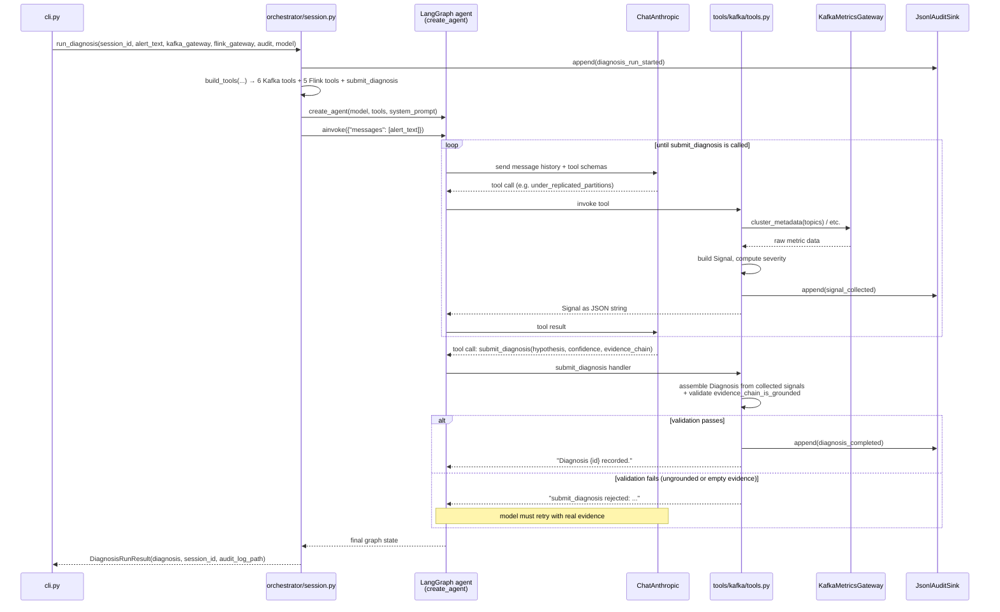

# Kafka diagnostic module

**Status: Implemented (Phase 1).** See [`flink.md`](flink.md) (also implemented, Phase 2a) and [`dbt.md`](dbt.md) (planned, Phase 3) for the other modules.

## What it does

Given an incident alert (e.g. "consumer lag alert on billing-svc/orders"), the agent investigates using six read-only Kafka diagnostic tools. It then produces a `Diagnosis`: a root-cause hypothesis backed by an evidence chain, where every claim traces back to a real tool call made in that session. It cannot invent a metric value. See [Grounding: how the evidence chain is enforced](#grounding-how-the-evidence-chain-is-enforced) for how that is guaranteed in code, not just by prompting.

## Code flow



## Signals collected

Each signal is a typed `Signal` (see `evidence/schema.py`), not free text. The model's reasoning is grounded in structured JSON it cannot paraphrase away from.

| Tool | File | What it detects |
| --- | --- | --- |
| `under_replicated_partitions` | `tools/kafka/tools.py` | Broker failure, disk pressure, or network partition (diffs `replicas` vs `isr` per partition) |
| `isr_churn` | `tools/kafka/tools.py` | Flaky broker, GC pauses, or network instability (ISR shrink/expand rate per broker) |
| `consumer_lag_trend` | `tools/kafka/tools.py` | Processing can't keep up, a stuck consumer, or an upstream burst (high watermark minus committed offset per partition) |
| `rebalance_frequency` | `tools/kafka/tools.py` | Session-timeout misconfig, slow poll loop, or crash-looping consumer (consumer group state transitions) |
| `hot_partition_skew` | `tools/kafka/tools.py` | Poor partition key choice or a noisy producer (per-partition throughput skew ratio) |
| `schema_registry_compat` | `tools/kafka/tools.py` | A producer shipped an incompatible schema change |

The build order followed the cascading-failure example this module is built around. `under_replicated_partitions` and `isr_churn` came first, since they form the actual root-cause chain (ISR churn causes under-replication). `consumer_lag_trend` came next, the visible symptom. The remaining three signals came last, they rule out alternative hypotheses.

## The gateway abstraction: one seam, two implementations

Every tool talks to Kafka through the `KafkaMetricsGateway` Protocol (`tools/kafka/gateway.py`), not directly through `confluent-kafka` or an HTTP client. This is the one seam that makes the whole loop testable without a live cluster:

- **`LiveKafkaGateway`** (`tools/kafka/live_gateway.py`): the real implementation. Uses `confluent-kafka`'s `AdminClient` for metadata and consumer-group state, a JMX-Prometheus exporter scrape (cached for 5s so one session doesn't re-fetch the same payload twice) for broker and partition metrics, and the Schema Registry REST API. Verified against a real 3-broker cluster, see [`docs/docker.md`](docker.md). One tool doesn't have a real live data source: `hot_partition_skew` needs per-partition throughput, and Kafka's own JMX only exposes that at broker and topic level, never per-partition. It always returns an empty result in live mode, this is a real gap, not an oversight, see `live_gateway.py`'s docstring.
- **`FixtureKafkaGateway`** (`tools/kafka/fixture_gateway.py`): loads a JSON snapshot and returns deterministic canned responses. Used by every test and by the CLI's `--fixture` flag, so the agent's reasoning can be exercised and demoed with no live infrastructure.

## Grounding: how the evidence chain is enforced

The core safety requirement this module is built around: the agent's reasoning has to stay grounded in real metrics, not paraphrased summaries. This is enforced at three points, not just by prompt instructions:

1. **Tools return structured data.** Every Kafka tool returns `signal.model_dump_json()`, a pydantic-validated `Signal`, never prose.
2. **Signals are tracked server-side, not restated by the model.** `build_kafka_tools` and `build_diagnosis_output_tools` (`tools/registry.py`) share one `collected_signals: list[Signal]` list, appended to on every tool call. When the model calls `submit_diagnosis`, the `Diagnosis` is assembled from that list. The model only has to cite `signal_id`s in its `evidence_chain`, it never restates signal payloads.
3. **`Diagnosis.evidence_chain_is_grounded`** (`evidence/schema.py`) is a pydantic `model_validator` that runs the moment `submit_diagnosis` is called. It rejects the diagnosis, as a tool error, forcing the model to retry with real evidence, if `evidence_chain` or `signals` is empty, or if any `evidence_chain` entry cites a `signal_id` that was not actually collected in that session.

## Example run

```
dp-ops-agent diagnose \
  --fixture tests/fixtures/kafka/urp_lag_spike_incident.json \
  --flink-fixture tests/fixtures/flink/healthy_baseline.json \
  --alert-text "PagerDuty: consumer lag alert on billing-svc/orders"
```

Against the fixture (partition 7 of `orders` under-replicated, ISR shrunk to a single broker, consumer lag spiking on that partition only), the agent correctly identified broker 1's rising ISR-shrink rate as the earliest signal in the cascade, not the consumer lag that actually triggered the alert. It also ruled out rebalancing and hot-partition skew using the other signals it pulled:

> *"Broker 1 (leader for the affected partition) shows a critical, rising ISR-shrink rate, indicating it is actively evicting out-of-sync followers — the earliest observable signal in the cascade, preceding the under-replication and consumer lag."*

The resulting audit log (`logs/audit/{session_id}.jsonl`) contains the full sequence: `diagnosis_run_started`, then 7 `signal_collected` events, then `diagnosis_completed`.

## Testing without live Kafka

- `tests/unit/test_kafka_tools.py`: calls each tool's `.ainvoke(args)` directly against `FixtureKafkaGateway`. No LLM involved.
- `tests/integration/test_registry_wiring.py`: builds the tool list exactly as `orchestrator/session.py` does, and exercises the grounding validator end to end. A real signal cited correctly gets accepted, a fabricated `signal_id` gets rejected, empty evidence gets rejected.
- `tests/integration/test_diagnose_loop.py`: the real loop against a live model. Opt-in only (`pytest -m llm`, needs `ANTHROPIC_API_KEY`). Asserts mechanically that evidence is grounded, rather than judging the prose.
