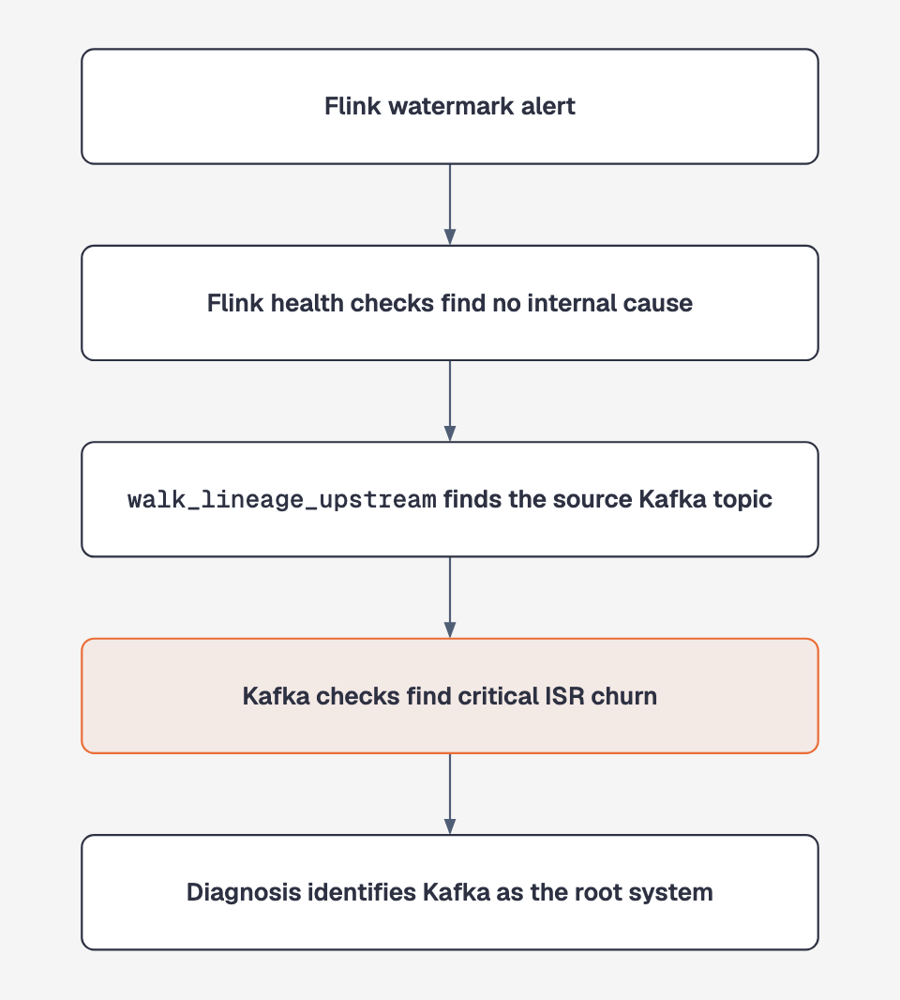

# Lineage module

> **Status:** Implemented in Phase 2b

The lineage module connects system-specific diagnostics. It lets the agent start from a Kafka topic, Flink job, dbt model, or warehouse table and discover upstream dependencies.

Related modules: [Kafka](kafka.md) · [Flink](flink.md) · [dbt](dbt.md)

## Why lineage matters

Kafka and Flink tools can diagnose their own systems. Lineage lets one investigation cross the boundary between them:

<p align="center">
  
</p>

This is cross-system localization, not two unrelated single-system checks.

## Tool

| Tool | Purpose | Severity behaviour |
| --- | --- | --- |
| `walk_lineage_upstream` | Finds upstream nodes for a known Kafka topic, Flink job, dbt model, or warehouse table | `ok` for a known node; `unknown` for a node absent from the graph |

A lineage result is graph structure, not a health verdict. It is never `warn` or `critical`. The agent must investigate the returned upstream node with the appropriate diagnostic tools.

For a known node, an empty upstream list means "this node has no recorded ancestors." For an unknown node, an empty result means "no lineage data exists." The module keeps those cases distinct with `LineageGraphView.node_found`.

## Flagship scenario

The cross-system evaluation starts with a Flink watermark-lag alert:

1. Flink reports critical watermark lag.
2. Checkpoints, backpressure, disk pressure, and restore history are healthy.
3. `walk_lineage_upstream` maps the job to the `orders` Kafka topic.
4. Kafka diagnostics find critical ISR churn on broker 1.
5. The diagnosis cites Kafka's `isr_churn` as `root_cause_signal_id`.
6. `Diagnosis.system` is derived as `kafka`.

The scenario is implemented in fixtures and as the `cross_system_watermark_lag_to_isr_churn` live-model evaluation.

## Gateway design

The lineage tool depends on the `LineageQueryGateway` protocol.

| Implementation | Purpose | Data source |
| --- | --- | --- |
| `LiveLineageGateway` | Real infrastructure | Marquez REST API |
| `FixtureLineageGateway` | Deterministic tests and evaluations | JSON snapshots keyed by `node_id` |

### Live traversal

Marquez returns both upstream and downstream nodes within the requested depth. `LiveLineageGateway` walks `inEdges` backwards from the requested node and returns ancestors only.

The implementation has been verified against Marquez 0.51.1 using the Docker demo topology.

### Error handling

- A Marquez "job not found" or "dataset not found" response becomes `node_found: false` and `severity: unknown`.
- An unrelated 404, such as a bad URL path, remains a tool error.
- Server errors remain tool errors.

This prevents a configuration problem from being misreported as "nothing upstream."

## Node IDs

The project uses one naming convention across gateways, fixtures, tools, and prompts:

| Node | Format | Example |
| --- | --- | --- |
| Kafka topic | `dataset:kafka:{topic}` | `dataset:kafka:orders` |
| Flink job | `job:flink:{job_name}` | `job:flink:orders-processing-job` |
| dbt model | `job:dbt:{model_name}` | `job:dbt:fct_orders` |
| Warehouse table | `dataset:warehouse:{schema}.{table}` | `dataset:warehouse:raw.orders_sink` |

dbt tools include the correct ID in `signal.scope.lineage_node_id`, so the model does not need to construct it.

The live Marquez environment currently contains Kafka and Flink nodes. dbt lineage is fixture-based.

## Root-system derivation

A cross-system evidence chain may contain both Flink and Kafka signals. List position is therefore not a reliable way to determine the root system.

`submit_diagnosis` requires an explicit `root_cause_signal_id`, then derives `Diagnosis.system` from that signal.

See [ADR-0006](decisions/0006-diagnosis-system-derived-not-asserted.md) and [ADR-0007](decisions/0007-root-cause-signal-id.md).

## Example

```bash
dp-ops-agent diagnose \
  --fixture tests/fixtures/kafka/isr_churn_upstream_incident.json \
  --flink-fixture tests/fixtures/flink/watermark_lag_cross_system_incident.json \
  --lineage-fixture tests/fixtures/lineage/flink_job_to_kafka_topic.json \
  --dbt-fixture tests/fixtures/dbt/healthy_baseline.json \
  --alert-text "PagerDuty: watermark lag alert on orders-processing-job"
```

The agent begins with Flink, follows lineage to Kafka, and returns `system: kafka` with the Kafka `isr_churn` signal as the root cause.

## Testing

| Test area | File | What it verifies |
| --- | --- | --- |
| Tool behaviour | `tests/unit/test_lineage_tools.py` | Fixture traversal and unknown-node handling |
| Cross-system wiring | `tests/integration/test_registry_wiring.py` | Expected severities and Kafka root-system derivation |
| Live gateway | `tests/unit/test_lineage_live_gateway.py` | Marquez response parsing, ancestor filtering, and error handling |
| Agent evaluation | `evals/scenarios.py` | A live model crosses from Flink to Kafka |

## Live Marquez

Start the seeded environment with:

```bash
./auto/live-up
```

See [docker.md](docker.md) for the complete workflow.

The live environment proves that lineage traversal works against real infrastructure. It does not inject the fixture's Kafka fault, so the model's final causal conclusion may differ from the labeled evaluation scenario.
